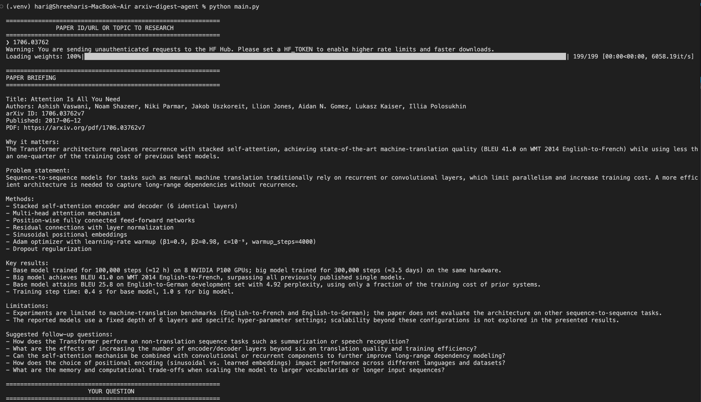
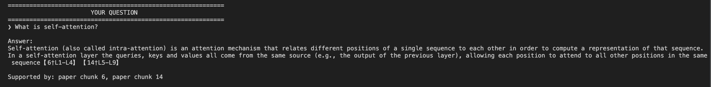
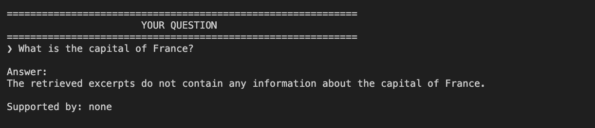
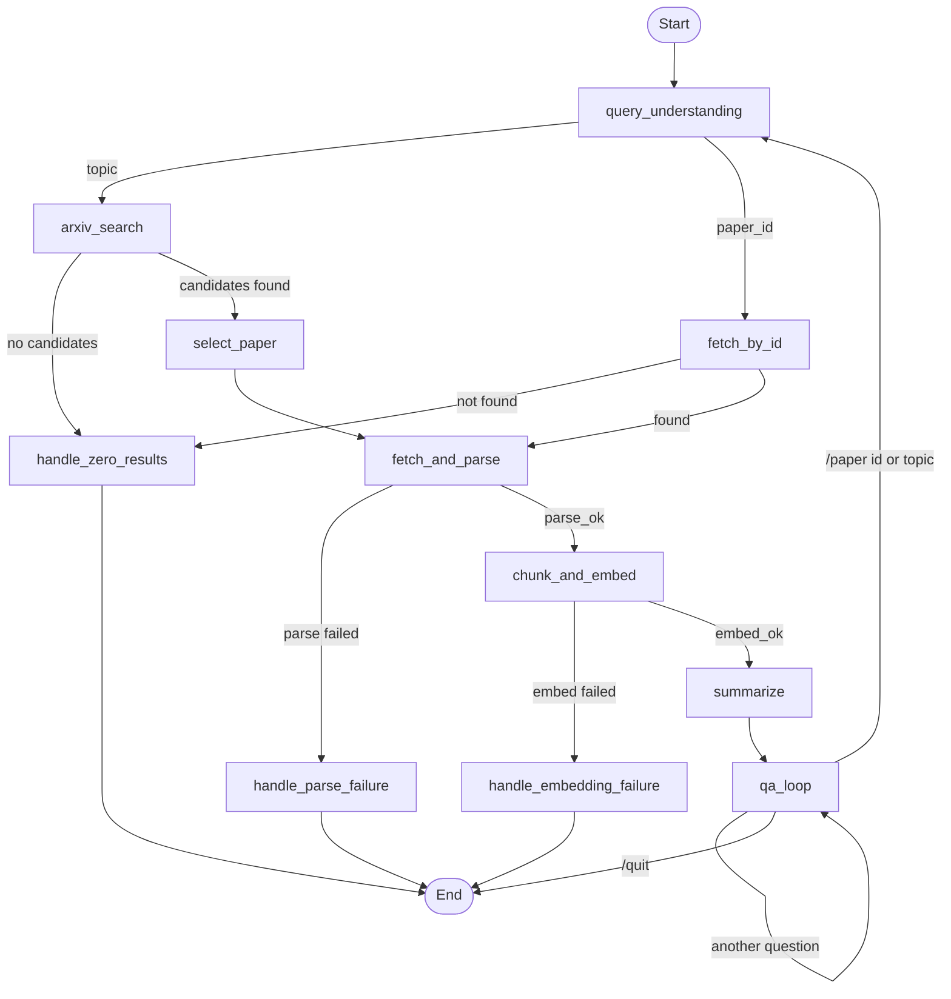

# arXiv Paper Digest & QA Agent

An agent that takes a research topic or an arXiv paper ID/URL, resolves it to a single paper, parses and embeds the PDF, generates a structured briefing, and then answers follow-up questions grounded in retrieved excerpts from that paper. The whole flow, including the interactive Q&A loop and switching to another paper mid-session, is one explicit [LangGraph](https://github.com/langchain-ai/langgraph) state machine rather than a linear script with an LLM call attached.

## Overview

Input is either a topic (`"KV-cache compression for LLMs"`) or an arXiv ID/URL (`1706.03762`, `https://arxiv.org/abs/1706.03762`). The agent resolves it to one paper, chunks and embeds the paper into a local Chroma store, prints a briefing, and then enters a Q&A loop where every answer is built from chunks retrieved from that paper.


## Demo

### 1. Paper Input & Briefing

The agent accepts an arXiv paper ID, URL, or research topic and generates a structured briefing from the selected paper.



### 2. Grounded Question Answering

Follow-up questions are answered using retrieved excerpts from the selected paper, with the supporting chunk numbers shown in the response.



### 3. Handling Unsupported Questions

When the paper does not contain relevant information, the agent returns a deterministic "not found" response instead of relying on the LLM to guess.




## Features

- Regex-based classification of topic vs. paper ID/URL (no LLM call for this step)
- arXiv topic search and direct lookup through the official `arxiv` package
- PDF download with a retry, a size cap and a 60-page cap; text extraction with PyMuPDF
- Overlapping chunking and persistent Chroma storage, reused across runs for papers already processed
- Briefing built from five targeted retrieval queries instead of the full paper text
- Grounded QA: retrieval runs before the LLM, and a grounding gate returns a fixed "not found" reply when nothing relevant is retrieved
- Conversation history for follow-up questions, used as context and never as evidence
- Paper switching during a session (`/paper`), implemented as a cycle in the graph
- Dedicated failure nodes for zero search results, PDF parsing failures and embedding failures

## Architecture

The agent is one `StateGraph` over a shared `AgentState` (`src/state.py`). Every step, from resolving the paper to each turn of the Q&A loop, is a node or edge in that graph. `main.py` calls `graph.invoke()` once; that call runs the entire interactive session, because the Q&A loop is a conditional self-edge inside the graph rather than a Python `while` loop around repeated invocations.

Nodes are plain functions that take the state and return only the keys they changed; LangGraph merges the returned dict into the running state. Expected failures (no results, unparseable PDF, embedding error) are returned as an `error` field, and a conditional edge routes to a dedicated terminal node instead of raising.

## Graph Flow



The diagram matches the compiled graph in `src/graph.py`. The `qa_loop → query_understanding` edge is what makes paper switching possible: the new paper goes through the whole pipeline again inside the same graph run.

## Project Structure

```
arxiv-digest-agent/
├── main.py                        # entrypoint: one prompt, then graph.invoke()
├── requirements.txt
├── src/
│   ├── state.py                   # AgentState, PaperMeta, Briefing, QATurn
│   ├── graph.py                   # builds and compiles the StateGraph
│   ├── llm.py                     # Groq client wrapper (call_llm)
│   ├── prompts.py                 # briefing and QA prompts
│   ├── vectorstore.py             # Chroma client, collections, queries
│   └── nodes/
│       ├── query_understanding.py # topic vs. paper_id classification
│       ├── arxiv_search.py        # topic search, ID lookup, paper selection
│       ├── parsing.py             # PDF download + PyMuPDF extraction
│       ├── retrieval.py           # chunking, chunk_and_embed, semantic + lexical retrieval
│       ├── summarize.py           # briefing generation
│       ├── qa.py                  # Q&A loop node and answer_question()
│       └── failures.py            # terminal failure nodes
├── tests/
│   ├── test_retrieval.py
│   ├── test_qa.py
│   └── test_failures.py
├── data/chroma/                   # created at runtime, gitignored
└── .env                           # GROQ_API_KEY, gitignored
```

## How It Works

### 1. Query Understanding

Two regexes are checked in order: a bare arXiv ID (`1706.03762`, optionally versioned) and an `arxiv.org/abs/...` or `arxiv.org/pdf/...` URL. A match sets `intent="paper_id"` with the normalized ID as `parsed_query`; anything else becomes `intent="topic"` with the trimmed input used as the search query. Only modern-format IDs are recognized. `route_intent` sends the graph to `arxiv_search` or `fetch_by_id`.

### 2. arXiv Retrieval

`arxiv_search` runs `arxiv.Search(query=..., max_results=10, sort_by=Relevance)`. `fetch_by_id` runs `arxiv.Search(id_list=[...])`. `select_paper` takes the top-ranked candidate, so topic search depends on arXiv's own relevance ranking. Client exceptions and empty results are both converted to an `error` and routed to `handle_zero_results`.

### 3. PDF Parsing

`fetch_and_parse` downloads the PDF with `requests` (30 s timeout, one retry, 50 MB cap enforced while streaming) and extracts text with PyMuPDF. Only the first 60 pages are read; if the paper is longer, `truncated=True` and the briefing screen warns that answers are limited to the parsed portion. If fewer than 500 characters come out, the PDF is treated as scanned or image-only and reported as a parse failure (there is no OCR).

### 4. Chunking & Embeddings

`chunk_and_embed` splits the text into 1000-character chunks with 150 characters of overlap; a trailing fragment under 50 characters is dropped, and text shorter than one chunk stays as a single chunk. Fixed-size windows were chosen over heading-based splitting because PDF-extracted text rarely keeps reliable section structure.

Embeddings use `all-mpnet-base-v2` through Chroma's `SentenceTransformerEmbeddingFunction`. It is a sentence-embedding model: it maps text to a vector so that semantically similar passages land close together. Chroma applies it on both `add()` and `query()`, so stored chunks and queries always use the same model. Each chunk is stored with `arxiv_id` and `chunk_index` metadata.

A `PersistentClient` writes the collection (one per paper, named from the arXiv ID) to `data/chroma/`. If a paper's collection already exists and is non-empty, chunking and embedding are skipped on the next run.

### 5. Paper Briefing

`summarize` does not send the paper to the LLM. It runs five fixed queries against the paper's collection (problem, methods, definitions of key terms/acronyms, results, limitations), takes the top 2 chunks per query, de-duplicates them and passes only that evidence to the model. This keeps the prompt small for any paper length and ties each briefing field, including limitations, to retrieved text. The prompt requires JSON output, forbids outside knowledge, keeps acronyms as written unless the paper expands them, and requires at least one limitation.

### 6. Grounded QA

For each question, `answer_question` retrieves first and calls the LLM second:

1. If there is history, the retrieval query is the previous question and answer plus the current question, so follow-ups like "what about its limitations?" retrieve against the right topic.
2. `retrieve_for_qa` returns semantic and lexical matches (see below).
3. If nothing is returned, the function replies with a fixed message and never calls the LLM: *"I couldn't find content in this paper related to that question."*
4. Otherwise each chunk is labeled `[Paper chunk N]` and passed to the LLM with the question and history. The system prompt restricts the model to those excerpts, requires it to state what is unsupported, and asks it to end with `Supported by: paper chunk X`.

### 7. Stateful Conversation & Paper Switching

`conversation_history` is a list of `QATurn(question, answer)` inside `AgentState`. It is included in the QA prompt, which states that history is context and not evidence.

`/paper <arXiv ID or topic>` resets the paper-specific state (briefing, text, vector store reference, history) and sets `next_action="change_paper"`; `route_qa` then routes back to `query_understanding`. `/quit` (also `quit`, `exit` or an empty line) ends the session.

### 8. Failure Handling

| Node | Reached when |
|---|---|
| `handle_zero_results` | topic search returns nothing, an ID/URL does not resolve, or the arXiv call fails |
| `handle_parse_failure` | PDF download fails, the file cannot be opened, or almost no text is extracted |
| `handle_embedding_failure` | chunking yields nothing or storing embeddings in Chroma fails |

Each node passes along the specific error set upstream, and `main.py` prints it when the graph finishes. If briefing generation fails (invalid JSON or an LLM error), the error is recorded and the session continues into Q&A without a briefing.

## Retrieval & Grounding Strategy

QA retrieval (`retrieve_for_qa` in `src/nodes/retrieval.py`) combines two channels:

- **Semantic:** the query is embedded and Chroma returns the 8 nearest chunks. Only chunks with distance below **0.65** are kept. No custom distance metric is configured, so this is Chroma's default (squared L2) over `all-mpnet-base-v2` embeddings; the threshold is tuned to that combination.
- **Lexical:** terms of 4+ characters are extracted from the query (hyphenated terms such as `self-attention` stay intact, common question words are dropped), and every chunk containing a term as a case-insensitive substring is added. This catches exact technical terms that an embedding can miss. Lexical matches are not subject to the distance threshold.

Results are merged (semantic first, then lexical), de-duplicated by chunk text and capped at 8.

How this keeps answers grounded:

- **Retrieval happens before the LLM.** The model only receives paper evidence through the retrieved chunks; the question and conversation history are provided separately as context.
- **The retrieval result is the grounding gate.** If neither channel returns a chunk, the fixed "not found" reply is returned and the LLM is not called.
- **Retrieved chunks are passed explicitly** as labeled excerpts, and the prompt restricts the model to them and asks it to cite the chunk numbers it used.
- **History is context, not evidence.** The prompt says so explicitly.
- **Prompt-level fallback.** When a question is only partly covered, or weak matches get through the gate, the model is instructed to say the excerpts do not support the answer.

The hard refusal is most reliable for standalone questions. On follow-ups the retrieval query includes the previous exchange, which makes it likelier that some chunk is returned, so the prompt-level restriction does more of the work there.

## State Management

`AgentState` is a `TypedDict(total=False)`. Its fields fall into these groups:

- **Input and routing:** `user_input`, `intent`, `parsed_query`
- **Paper resolution:** `candidates`, `selected_paper` (a `PaperMeta`)
- **Parsing:** `raw_text`, `parse_ok`, `truncated`
- **Retrieval:** `vectorstore_ref` (Chroma collection name), `chunk_count`, `embed_ok`
- **Briefing:** `briefing` (a `Briefing` dataclass)
- **QA:** `conversation_history`, `continue_qa`, `last_answer`, `next_action` (the signal `route_qa` reads: `qa`, `change_paper` or `end`)
- **Errors:** `error`

State is held in memory for the duration of the single `graph.invoke()` call. The only thing that persists between runs is Chroma's on-disk storage under `data/chroma/`, which holds chunk embeddings keyed by paper. Briefings and conversation history are not stored anywhere; restarting the program keeps a paper's embeddings but starts a fresh conversation and generates a new briefing.

## Design Decisions

- **One graph for the whole session.** Keeping the Q&A loop and paper switching inside the graph means the interactive part is as inspectable as the pipeline, and switching papers is a graph edge rather than separate application code.
- **Regex before LLM for query understanding.** arXiv IDs and URLs have a fixed shape, so classification is deterministic, free and cannot fail.
- **Fixed-size overlapping chunks.** Robust across arbitrary PDFs; the cost is that chunk boundaries ignore sentence and section structure. The overlap keeps ideas near a boundary intact in at least one chunk.
- **`all-mpnet-base-v2`.** Better embedding quality than smaller models at the cost of a larger download and slower embedding, which is acceptable when one paper is processed at a time.
- **Briefing from targeted retrieval.** Bounded prompt size and every section anchored to retrieved evidence, at the cost of coverage: the briefing only reflects the chunks the five queries surface.
- **Hybrid retrieval for QA.** The lexical channel is a hedge against paraphrase mismatches in embeddings; the trade-off is that lexical hits bypass the distance threshold.
- **Minimal chunk metadata.** Only `arxiv_id` and `chunk_index` are stored, so citations refer to chunk numbers rather than pages or sections.
- **Groq with `openai/gpt-oss-120b`.** A free-tier hosted open-weight model at `temperature=0`, with a 60 s timeout and one retry.

## Setup

Requires Python 3.10 or newer (the code uses `str | None` type hints).

```bash
git clone https://github.com/Shreehari17/arxiv-digest-agent.git
cd arxiv-digest-agent
python3 -m venv .venv && source .venv/bin/activate
pip install -r requirements.txt
```

### requirements.txt

```
# Agent graph
langgraph>=0.2.0

# arXiv access and PDF handling
arxiv>=2.1.0
requests>=2.31.0
PyMuPDF>=1.24.0

# Embeddings and vector store
sentence-transformers>=3.0.0
chromadb>=0.5.0

# LLM
groq>=0.11.0
python-dotenv>=1.0.0

# Testing
pytest>=8.0.0
```

`sentence-transformers` pulls in PyTorch, so the first install is large. The first run also downloads the `all-mpnet-base-v2` model (a few hundred MB) from Hugging Face and caches it locally.

## Environment Variables

`src/llm.py` reads a Groq API key from the environment (loaded from `.env` via `python-dotenv`). Create `.env` in the project root:

```
GROQ_API_KEY=your-groq-api-key
```

A free-tier key from [console.groq.com](https://console.groq.com) is sufficient. It is the only variable the code reads, and `.env` is gitignored.

## Running the Agent

```bash
python main.py
```

`main.py` takes no command-line arguments. It shows a `PAPER ID/URL OR TOPIC TO RESEARCH` prompt once and then runs the whole session. At the `YOUR QUESTION` prompt:

- Type a question to get a grounded answer.
- `/paper <arXiv ID or topic>` switches to another paper.
- `/quit` (or `quit`, `exit`, or an empty line) ends the session.

## Example Session

A session on *Attention Is All You Need* (arXiv 1706.03762). Output is abridged, and the wording of LLM-generated text varies between runs.

```
$ python main.py

============================================================
             PAPER ID/URL OR TOPIC TO RESEARCH
============================================================
❯ 1706.03762

(paper is resolved, parsed, embedded and briefed; the briefing is printed here)

============================================================
                       YOUR QUESTION
============================================================
❯ What is the capital of France?

Answer:
I couldn't find content in this paper related to that question.

============================================================
                       YOUR QUESTION
============================================================
❯ What is self-attention?

Answer:
Self-attention relates different positions of a single sequence in order to
compute a representation of that sequence.
Supported by: paper chunk 6

============================================================
                       YOUR QUESTION
============================================================
❯ What has it been used for?

Answer:
It has been used for reading comprehension, abstractive summarization, textual
entailment and learning task-independent sentence representations.
Supported by: paper chunk 6

============================================================
                       YOUR QUESTION
============================================================
❯ /paper 1810.04805

Switching paper to: 1810.04805
(new paper is resolved, embedded and briefed; briefing printed here)

============================================================
                       YOUR QUESTION
============================================================
❯ /quit
```

The off-topic question is asked first, when there is no history: nothing is retrieved, so the fixed reply is returned without an LLM call. "What has it been used for?" only makes sense given the previous answer, which is why the previous exchange is included in retrieval and in the prompt.

## Testing

```bash
pytest tests/ -v
```

There are 13 tests in three files:

- `tests/test_retrieval.py`: `chunk_text` (empty text, short text as one chunk, splitting, overlap), a store-and-query round trip against Chroma, and the QA distance-threshold filter.
- `tests/test_qa.py`: `answer_question` with retrieval and the LLM mocked. Covers an answerable question, an unsupported question and weak retrieval (the LLM must not be called), and conversation history appearing in the prompt.
- `tests/test_failures.py`: the three failure nodes return the expected error messages.

The Chroma round-trip and threshold tests use the real embedding model, so the first run needs network access to download it. Query classification, PDF parsing, arXiv calls and the assembled graph are not covered by automated tests; the full pipeline was exercised manually on arXiv 1706.03762.

## Limitations

- Topic search relies on arXiv's relevance ranking and always takes the first result; it may not pick the paper you had in mind. An arXiv ID is the reliable way to target a paper.
- Only text-based PDFs are supported. Scanned or image-only PDFs are detected and reported, not OCR'd.
- Only the first 60 pages are parsed; for longer papers, answers are limited to that portion (the briefing screen says so).
- Only modern arXiv IDs (`YYMM.NNNNN`) are recognized as direct lookups.
- Retrieval quality depends on the 0.65 distance threshold and the embedding model. Lexical matches can bring in weakly related chunks, and follow-up questions are more likely than standalone ones to reach the LLM.
- Chunk citations (`Supported by: paper chunk N`) are written by the model following the prompt; the code does not verify them.
- Conversation history and briefings are not saved between runs; only chunk embeddings are.
- Briefing and answers need a working Groq connection and API key. A request is retried once; if it fails again during a question, the session ends with an error.
- Chroma storage is local to the machine running the agent.

## Assessment Coverage

| Area | Where it is addressed |
|---|---|
| Agent / graph design | One `StateGraph` covering resolution, parsing, embedding, briefing, the Q&A loop and paper switching as a graph cycle; three explicit failure nodes ([Graph Flow](#graph-flow)) |
| Correctness & grounding | Retrieval before every LLM call, a retrieval-based grounding gate, excerpt-restricted prompts, chunk citations, history as context only ([Retrieval & Grounding Strategy](#retrieval--grounding-strategy)) |
| Retrieval & parsing quality | Overlapping chunks, persistent Chroma with reuse, hybrid semantic + lexical retrieval, page and size limits, scanned-PDF detection ([How It Works](#how-it-works)) |
| Code quality | Modules split by responsibility (`nodes/`, `vectorstore.py`, `llm.py`, `prompts.py`), typed state, failures returned as state rather than raised, a unit test suite |
| Communication | This README, including design decisions and limitations |
